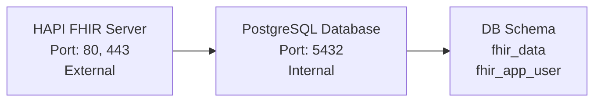

# 🔥 FHIRStore - FHIR Server
> A containerised HAPI FHIR server running on PostgreSQL

[](https://www.docker.com/)
[](https://hapifhir.io/)
[](https://www.postgresql.org/)

## 🚀 Quick Start

Get your FHIR server running in seconds:

```bash
# Build customisations (if any)
./build.sh

# Start
docker compose up -d

# Check status
docker compose ps
```

**🎉 That's it!** Your FHIR server is now running at `http://localhost`

## 🏗️ Architecture



## 🔧 Customisations

This project supports custom FHIR interceptors and configurations to extend the server functionality.

### Structure
```
src/main/java/io/github/steveswinsburg/fhirstore/
├── interceptors/               # FHIR interceptors
└── ...                         # Other customisations
```

### Adding New Interceptors

1. Create your interceptor class in `src/main/java/io/github/steveswinsburg/fhirstore/interceptors/`:

```java
@Component
@Interceptor
public class MyInterceptor {
    @Hook(Pointcut.SERVER_INCOMING_REQUEST_PRE_HANDLED)
    public void intercept(RequestDetails requestDetails) {
        // Your logic here
    }
}
```

2. Build and restart:
```bash
./build.sh
docker compose up -d fhir
```

The HAPI FHIR server automatically discovers interceptors via Spring's component scanning.

### Build Process

The `./build.sh` script:
1. Compiles the Java customisations into a JAR (`target/fhirstore-customisations-1.0.0.jar`)
2. Builds a custom Docker image extending the official HAPI FHIR image
3. Copies the JAR and configuration into the container
4. Copies the keystore into the container (for SSL)     

## 🛠️ Configuration

### Database Setup
- **User**: `fhir_app_user` (application user)
- **Schema**: `fhir_data` (dedicated FHIR schema)
- **Admin**: `admin` (database administration)

The user and schema are initialized on startup.

### FHIR Configuration
Custom application settings are in `hapi.application.yaml`.

## ⚙️ Environment Variables

The project uses a `.env` file to configure sensitive settings and provides them to docker-compose. Copy the provided `.env` file and modify as needed:

### Admin Credentials
```bash
FHIR_ADMIN_USERNAME=admin
FHIR_ADMIN_PASSWORD=admin123
```

These credentials are required to be provided via Basic Auth for all write requests.

### Database Settings
```bash
POSTGRES_USER=admin
POSTGRES_PASSWORD=admin
POSTGRES_DB=hapi
```

## 📜 FHIR Implementation Guide Auto-Import

FHIRStore has built-in support for automatically loading Implementation Guides.

### Quick Setup

1. **Edit `conf/hapi.application.yaml`**:
   ```yaml
   hapi:
     fhir:
       implementationguides:
         au-base:
           name: hl7.fhir.au.base
           version: 6.0.0
           installMode: STORE_AND_INSTALL
   ```

2. **Restart FHIR server**:
   ```bash
   docker compose restart fhir
   ```

### Configuration Options

| Option | Description | Values |
|--------|-------------|--------|
| `name` | Package ID from packages.fhir.org | `hl7.fhir.au.base` |
| `version` | Specific version | `4.2.0` |
| `installMode` | How to handle the IG | `STORE_AND_INSTALL`, `STORE_ONLY`, `INSTALL_ONLY` |
| `packageUrl` | Direct package URL (optional) | `https://example.org/package.tgz` |
| `reloadExisting` | Reload if already installed | `true`, `false` |

### Examples

```yaml
implementationguides:
  # From NPM registry
  au-base:
    name: hl7.fhir.au.base
    version: 6.0.0
    installMode: STORE_AND_INSTALL
  
  # From custom URL
  my-ig:
    name: my.custom.ig
    version: 1.0.0
    packageUrl: https://example.org/package.tgz
    installMode: STORE_AND_INSTALL
    reloadExisting: true
  
  # From local file
  my-ig:
    name: my.local.ig
    version: 0.0.1
    packageUrl: file:///app/igs/package.tgz
    installMode: STORE_AND_INSTALL
    reloadExisting: true
```

*See [IG_IMPORT.md](IG_IMPORT.md) for more examples*

## 🔐 SSL Configuration

The project includes SSL/HTTPS support with a **self-signed certificate included** for immediate use.

### Quick Start (No SSL Setup Required)
```bash
# Start with included self-signed certificate
docker compose up -d

# Access via HTTP or HTTPS
curl http://localhost/fhir/metadata
curl -k https://localhost/fhir/metadata  # -k ignores self-signed cert warnings
```

### Using Your Own Certificate

To replace the self-signed certificate with your own:

1. **Replace the keystore file**:
   ```bash
   cp your-certificate.jks conf/keystore.jks
   ```

2. **Update environment variables in `.env`**:
   ```bash
   echo "KEYSTORE_PASSWORD=your-keystore-password" >> .env
   echo "SSL_KEY_ALIAS=your-domain.example.com" >> .env
   ```

3. **Rebuild and restart the service**:
   ```bash
   ./build.sh
   docker compose up -d fhir
   ```

### SSL Configuration (Environment Variables)

| Variable | Description | Default | Example |
|----------|-------------|---------|---------|
| `KEYSTORE_PASSWORD` | Keystore password | `changeit` | `your-password` |
| `KEYSTORE_TYPE` | Keystore format | `PKCS12` | `PKCS12`, `JKS` |
| `SSL_KEY_ALIAS` | Certificate alias | `localhost` | `your-domain.com` |

### Creating a Keystore

#### From existing certificate files:
```bash
# Convert PEM certificate to PKCS12 keystore (recommended)
openssl pkcs12 -export -in certificate.crt -inkey private.key -out conf/keystore.jks -name "your-domain.com"
```

#### Self-signed certificate for testing:
```bash
# Generate self-signed certificate in PKCS12 format (recommended)
keytool -genkeypair -alias localhost -keyalg RSA -keysize 2048 -storetype PKCS12 -keystore conf/keystore.jks -validity 365 -dname "CN=localhost, OU=Development, O=Your Organization, L=Your City, ST=Your State, C=AU"
```

### Accessing the Server

The FHIR server is available at:
- HTTP: `http://localhost/fhir/metadata` (redirects to https)
- HTTPS: `https://localhost/fhir/metadata`

## 🔧 Commands

### Development
```bash
# Start services
docker compose up -d

# View logs
docker compose logs -f

# Stop services
docker compose down
```

### Database Access
```bash
# Connect to PostgreSQL
docker compose exec db psql -U admin -d hapi

# Check FHIR schema
docker compose exec db psql -U fhir_app_user -d hapi -c "\dt fhir_data.*"
```

### Troubleshooting
```bash
# Check container status
docker compose ps

# Restart specific service
docker compose restart fhir

# Rebuild container (for configuration/keystore changes)
docker compose build fhir --no-cache
docker compose up -d fhir

# Fresh start (removes data)
docker compose down -v
docker compose up -d
```

## 🌐 API Examples

### Get Server Metadata
```bash
curl -k https://localhost/fhir/metadata
```

### Create a Patient
```bash
curl -k -X POST https://localhost/fhir/Patient \
  -H "Content-Type: application/fhir+json" \
  -d '{
    "resourceType": "Patient",
    "name": [{"family": "Doe", "given": ["John"]}],
    "gender": "male"
  }'
```

### Create a Patient (with ID)
```bash
curl -k -X PUT https://localhost/fhir/Patient/abc1234 \
  -H "Content-Type: application/fhir+json" \
  -d '{
    "resourceType": "Patient",
    "id": "abc1234",
    "name": [{"family": "Doe", "given": ["John"]}],
    "gender": "male"
  }'
```

### Search Patients
```bash
curl "https://localhost/fhir/Patient?family=Doe"
```

## 📈 Scaling

### Horizontal Scaling
```bash
# Multiple FHIR instances
docker compose up --scale fhir=3
```

## 📜 License

This project is licensed under the Apache 2.0 License - see the [LICENSE](LICENSE) file for details.

**Made with ❤️ for the FHIR community**
